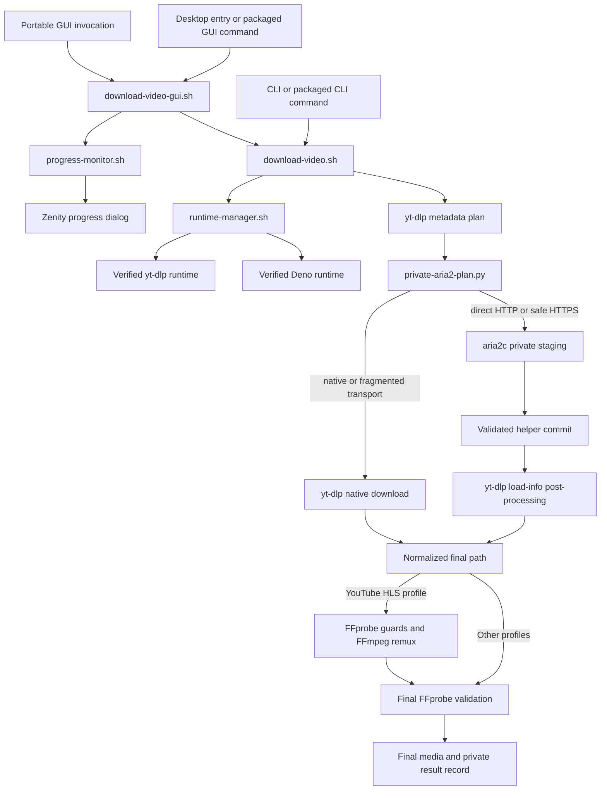

# Architecture

This document is the current technical map of
`yt-dlp-aria2-downloader-gui`. It explains how components interact and where
the security and lifecycle boundaries live. Use `REPOSITORY_FILES.md` for the
path-by-path inventory, `TESTING.md` for validation procedures, and the READMEs
for user-facing behavior.

## System overview

The project is a GNU/Linux desktop application with a Bash CLI engine, a Zenity
front end, a private Python transfer helper, managed per-user runtimes, native
RPM/DEB packages, and GitHub Actions release automation.



`download-video.sh` is the single source of truth for application version and
download behavior. The GUI collects a request and supervises the engine; it
does not implement a second download pipeline.

## Entrypoints and installed layout

| Interface | Source | Installed form | Responsibility |
| --- | --- | --- | --- |
| Graphical | `download-video-gui.sh` | `/usr/bin/yt-dlp-aria2-downloader-gui` symlink | Collect one request, supervise it, render progress, and report the result |
| Command line | `download-video.sh` | `/usr/bin/yt-dlp-aria2-downloader` symlink | Validate inputs and runtimes, select transport, download, validate, and publish one result |
| Portable launcher management | `install-gui.sh` | Run from a Git checkout or ZIP | Install or remove the current user's desktop launcher and embedded assets |
| Fedora bootstrap | `install-fedora.sh` | Published beside release packages | Authenticate a release RPM, install dependencies and the package, then prepare managed runtimes |

Native packages keep implementation files under a private libexec directory.
`packaging/install-tree.sh` creates the shared RPM/DEB payload, public symlinks,
desktop entry, icon, manpages, and user documentation. The Python helper remains
mode `0644` and is invoked explicitly by the engine with `python3`; it is not a
public command.

## Graphical session lifecycle

`download-video-gui.sh` performs one bounded session:

1. Resolve safe XDG configuration and state paths and validate required host
   commands, adjacent engine files, and `setsid` capabilities.
2. Load `gui.conf` only when it is a regular non-symbolic-link file within the
   64 KiB and 128-line limits. Collect the URL, profile, and destination with
   Zenity, then persist only the destination and selected profile; never
   persist the URL.
3. Create a private temporary session containing a mode-`0600` URL file, live
   log, result record, and process-group record.
4. Start `download-video.sh` in a dedicated session with
   `setsid --fork --wait`. The URL is passed through `--url-file`, not through
   the engine argument vector.
5. Feed the private live log to a separately supervised
   `progress-monitor.sh`, which emits Zenity's numeric/text protocol through a
   private mode-`0600` FIFO without learning or displaying the media URL.
6. Run captured Zenity dialogs as registered children with 64 KiB in-memory
   ingestion bounds. On cancellation, HUP, INT, TERM, or failure, signal and
   reap Zenity, the monitor, and the complete worker process group, escalating
   within bounded waits when necessary.
7. Accept success only when the worker succeeded and the private result record
   names a valid final path. Retain a sanitized diagnostic log only when useful;
   when its source exceeds 8 MiB, discard the first potentially partial tail
   line before URL redaction and enforce the size bound again afterward.

The GUI recognizes legacy audio-profile values solely to migrate old settings
to the current single native-audio profile.

## Engine pipeline

`download-video.sh` owns the end-to-end download contract:

1. Parse one URL from a direct argument, stdin, or a private URL file; reject
   line breaks, non-HTTP(S) schemes, and URL user information.
2. Resolve the destination canonically, acquire a same-user destination lock,
   recover abandoned owned staging directories, and remove only allowlisted
   stale temporary files.
3. Ask `runtime-manager.sh prepare update` for an attested yt-dlp/Deno pair, or
   `prepare require` when automatic managed-runtime updates are disabled.
4. Validate the yt-dlp, Deno, aria2c, and `setsid` versions or capabilities used
   by the current option contract, and require FFmpeg, FFprobe, and the other
   host commands used later in the pipeline.
5. Create private URL, cookie, plan, manifest, staging, and result-path state.
6. Run a metadata-only yt-dlp planning pass and ask
   `private-aria2-plan.py classify` whether the selected formats may use the
   direct aria2 path.
7. Execute exactly one selected transport, while publishing structured progress
   records when the GUI requested machine progress.
8. Validate the produced media with FFprobe. The repaired YouTube HLS profile
   additionally checks duration/tail consistency and remuxes to a temporary MKV
   with FFmpeg before no-overwrite publication.
9. Atomically publish the private result record only after the final media path
   is normalized, contained in the selected destination, and validated.

Nested long-running commands use dedicated process groups even when the engine
itself was launched without the GUI. HUP, INT, and TERM are relayed to those
groups, and cleanup removes only state owned by the current invocation.

## Transport boundary and Python helper

The initial yt-dlp pass resolves formats and filenames but does not download.
`private-aria2-plan.py` then exposes three internal subcommands:

- `classify` validates the plan and selects `direct` only for representable
  direct HTTP(S) formats whose headers can be safely replayed;
- `build` converts the validated plan into a mode-`0600` aria2 input file and a
  private manifest inside a mode-`0700` staging directory;
- `commit` validates completed staging files and publishes every component to
  the exact yt-dlp-selected destination without overwriting an existing path,
  rolling back partial publication when possible.

URLs and replayed HTTP headers are written to private files rather than command
arguments. aria2 diagnostics pass through URL redaction. Fragmented DASH/HLS,
unsafe headers, URL user information, unrepresentable formats, and HTTPS on an
aria2 build that lacks the required safety capability stay on yt-dlp's native
transport.

The helper is Python because bounded JSON parsing, URL decomposition, file-mode
inspection, and transactional manifest handling are clearer there than in
Bash. Its SPDX-plus-module-docstring header is the project-wide Python identity
contract; `SHELL_STYLE.md`'s Bash banner does not apply.

## Progress protocol

The engine writes human diagnostics and machine records to one private log.
`progress-monitor.sh` tails that log and maintains a monotonic display model for
yt-dlp native downloads, aria2 direct transfers, yt-dlp post-processing, and
FFmpeg remux progress.

Machine records include plan membership, stable format identifiers, byte or
fragment counters, post-processing state, FFmpeg duration/progress, and the
final result record. The monitor sanitizes untrusted fields, bounds arithmetic,
and confirms output through the private result file rather than treating a
progress percentage as proof of success.

## Managed runtimes and persistent state

`runtime-manager.sh` manages yt-dlp and Deno under:

```text
${XDG_DATA_HOME:-$HOME/.local/share}/yt-dlp-aria2-downloader/runtime/
```

Each component has immutable version directories and a `current` activation
link. Updates are serialized with a lock, candidates are downloaded into
private work areas, authenticated or checksum-verified according to the
component contract, and validated for exact version and required capabilities
before activation. Personal curl and yt-dlp configuration and yt-dlp plugins
cannot alter these probes or downloads. Engine attestations name the validated
immutable version paths rather than the mutable activation links. Activation
uses a journal so interrupted link changes can be recovered; a validated
previous version remains available for rollback.

The manager records an ownership sentinel for custom XDG data roots. Package
cleanup uses that evidence to avoid deleting unrelated user data.

The other persistent paths are:

| Data | Default location | Lifetime |
| --- | --- | --- |
| GUI preferences | `${XDG_CONFIG_HOME:-$HOME/.config}/yt-dlp-aria2-downloader/gui.conf` | Preserved across ordinary package removal |
| Retained sanitized logs | `${XDG_STATE_HOME:-$HOME/.local/state}/yt-dlp-aria2-downloader/` | Pruned by age and removed only by bounded cleanup |
| Managed runtimes | `${XDG_DATA_HOME:-$HOME/.local/share}/yt-dlp-aria2-downloader/runtime/` | Preserved across upgrade/removal; eligible for proven-owned final RPM cleanup |
| GUI live session | `${TMPDIR:-/tmp}/yt-dlp-gui.*` | Private and removed at session end unless a sanitized diagnostic is retained |
| Direct-transfer staging | Destination child `.yt-dlp-aria2.*` | Private, marker-owned, committed or recovered by the engine |

## Packaging architecture

`packaging/install-tree.sh` is the common payload assembler. The format-specific
builders wrap that tree:

- `packaging/rpm/build-rpm.sh` archives committed sources, builds the noarch RPM
  through the spec, and validates the produced payload;
- `packaging/deb/build-deb.sh` writes Debian control/checksum metadata, builds
  the architecture-independent DEB, and validates its payload;
- the RPM keeps `package-user-cleanup.sh` for its final erase scriptlet;
- the DEB deliberately removes that helper and preserves per-user data on
  remove and purge.

Both package families test install/remove/reinstall and an upgrade from the
previous immutable release. Package assembly intentionally installs current
user documentation but not contributor-only policy, tests, skills, or this
architecture document. The source ZIP contains the tracked source tree.

## CI and release trust zones

| Workflow | Responsibility |
| --- | --- |
| `shell.yml` | Canonical local suite on Ubuntu and Fedora |
| `packages.yml` | Git-free source archive, RPM/DEB construction, lifecycle, authentication, and previous-release upgrade |
| `real-tools.yml` | Pinned real-tool behavior plus scheduled current-stable qualification |
| `qualification.yml` | Supported FFmpeg/FFprobe generation matrix |
| `stress.yml` | Repeated cancellation, runtime, and cleanup race coverage |
| `shfmt-update.yml` | Prepare an untrusted formatter-pin candidate, verify it separately, and publish only allowlisted data |
| `release.yml` | Validate an authorized tag, build once, sign, test, attest, publish immutably, then verify fresh public downloads |

Third-party Actions are pinned by full commit SHA and checkout credentials stay
disabled. Jobs receive only the permissions they need.

The release workflow separates untrusted validation/build work from privileged
publication. The RPM signing job receives signing secrets but does not execute
candidate repository code. The publisher consumes reviewed artifacts and
revalidates their inventory and digests before attestation and publication.
Fresh-download verification independently compares public immutable assets with
the tested artifacts.

Creating a tag, signing an RPM, publishing a release, or changing repository
secrets/environments is outside ordinary code-change authority.

## Validation architecture

`tests/lib/project-files.sh` is the canonical source inventory. `test-static.sh`
checks headers, Python module identity, repository-skill discovery metadata,
version coherence, workflow pins and permissions, packaging contracts, and
exact agreement between Git and the tracked-file table in
`REPOSITORY_FILES.md`.

`tests/run-all.sh` schedules static validation and isolated integration suites.
The `fast` profile is a development loop; the default `full` profile is the
complete hermetic local contract. Its separate `doctor` mode diagnoses command,
filesystem, loopback, formatter-bootstrap, network, and repository capabilities
without running tests or provisioning tools. Real tools, privileged package
lifecycle, interactive Zenity, release evidence, upstream generations, and
stress runs are separate qualifications documented in `TESTING.md`.

Contributor control is layered around that runner. Repository skills route a
task to the relevant policy; issue and pull-request templates make scope,
invariants, validation evidence, and external authority explicit; conservative
Codex execution rules prompt for Git, GitHub CLI, and common environment
wrappers requested outside the sandbox, and forbid common force-push-to-`main`
forms. These controls improve task execution but do not grant release, merge,
or repository-administration authority.

Tests use private temporary homes, mock binaries, fixtures, and bounded process
supervision. They are part of the architecture: changing a trust, cleanup,
progress, process, packaging, or compatibility boundary requires updating or
adding the matching regression proof.

## Change boundaries

When introducing a component or changing a connection between components:

1. update this document if the stable flow or boundary changes;
2. update `REPOSITORY_FILES.md` for every tracked path or changed consumer;
3. update source inventories and native packaging payloads when applicable;
4. update both READMEs only for user-visible behavior;
5. add or revise a regression test for the changed contract;
6. run the local and specialized validation required by `TESTING.md`.

Avoid duplicating a responsibility across GUI and engine, RPM and DEB builders,
or policy documents. Keep one authoritative implementation and make consumers
route through it.
