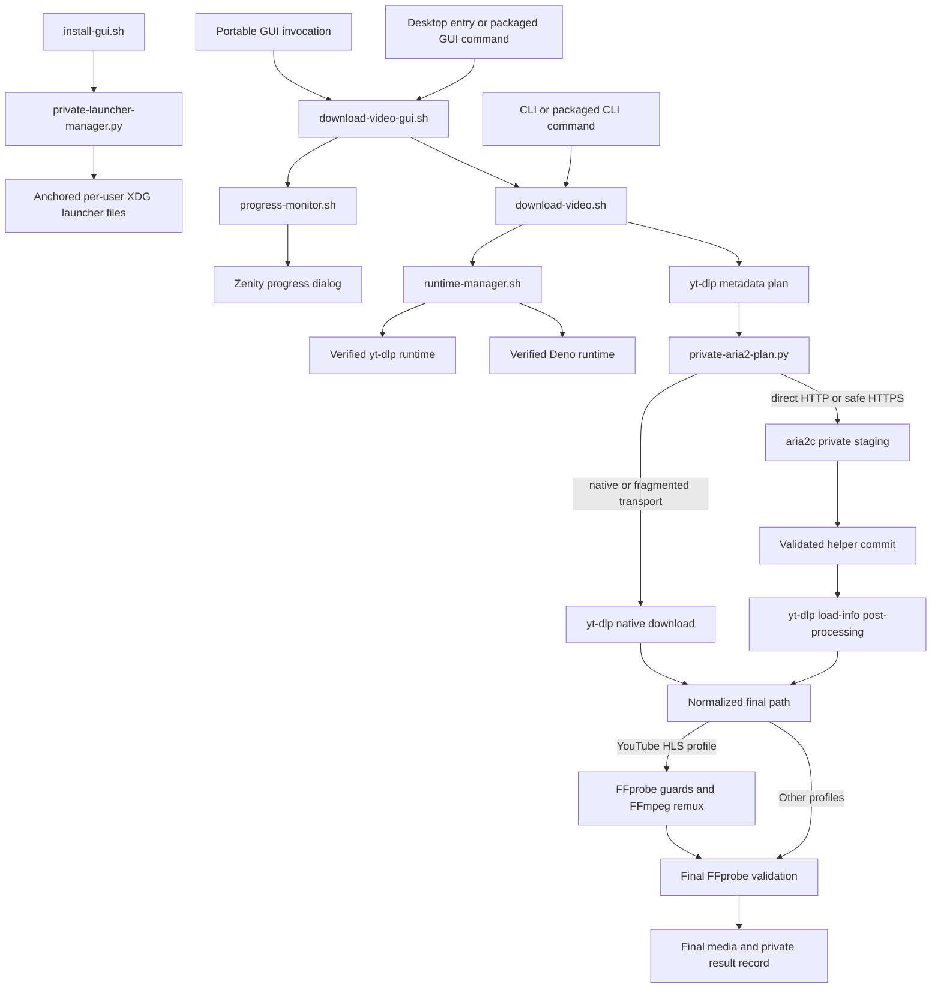

# Architecture

This document is the current technical map of
`yt-dlp-aria2-downloader-gui`. It explains how components interact and where
the security and lifecycle boundaries live. Use `REPOSITORY_FILES.md` for the
path-by-path inventory, `TESTING.md` for validation procedures, and the READMEs
for user-facing behavior.

## System overview

The project is a GNU/Linux desktop application with a Bash CLI engine, a Zenity
front end, private Python helpers, managed per-user runtimes, native
RPM/DEB packages, and GitHub Actions release automation.



`download-video.sh` is the single source of truth for application version and
download behavior. The GUI collects a request and supervises the engine; it
does not implement a second download pipeline.

## Entrypoints and installed layout

| Interface | Source | Installed form | Responsibility |
| --- | --- | --- | --- |
| Graphical | `download-video-gui.sh` | `/usr/bin/yt-dlp-aria2-downloader-gui` symlink | Collect one request, supervise it, render progress, and report the result |
| Command line | `download-video.sh` | `/usr/bin/yt-dlp-aria2-downloader` symlink | Validate inputs and runtimes, select transport, download, validate, and publish one result |
| Portable launcher management | `install-gui.sh` plus `private-launcher-manager.py` | Run from a Git checkout or ZIP | Validate the request, then install or remove the current user's desktop launcher through anchored filesystem operations |
| Fedora bootstrap | `install-fedora.sh` | Published beside release packages | Authenticate a release RPM, install dependencies and the package, then prepare managed runtimes |

Native packages keep implementation files under a private libexec directory.
`packaging/install-tree.sh` creates the shared RPM/DEB payload, public symlinks,
desktop entry, icon, manpages, and user documentation. Python helpers remain
mode `0644` and are invoked explicitly with `python3`; they are not public
commands. Only the aria2 helper belongs to the native package payload, because
the launcher helper is specific to ZIP and Git installations.

The portable launcher manager requires the data root and managed directories to
be owned by the current user and not writable by group or others, rejects the
filesystem root, rejects data paths that are not valid UTF-8 desktop-entry
input, and opens every `XDG_DATA_HOME` component with
`O_DIRECTORY|O_NOFOLLOW`. It holds the data root and each managed directory
open for the complete transaction. Install and uninstall take one exclusive
advisory lock on that anchored data-root inode before opening managed
directories, serializing cooperating transactions without a removable
lockfile; lock acquisition is bounded. The helper also opens and retains the
regular executable GUI target,
then revalidates its identity and executable mode before success. Python
`dir_fd` operations perform staging, validation, publication, and known-file
removal. Desktop validation has bounded time and captured output. Private hard
link backups in each destination directory allow every already-attempted leaf
publication or removal to roll back in reverse order when a later step fails.
The Bash entrypoint supervises the Python helper and keeps ordinary helper
failures normalized to status 1. HUP, INT, and TERM retain their public
129/130/143 statuses. Before forwarding TERM or retrying an interrupted wait,
the wrapper proves that its retained PID is still a direct child, so PID reuse
cannot redirect cancellation. The Python handler records the first request without
raising at an arbitrary bytecode; explicit checkpoints convert it into a
transaction exception only after the affected resource is registered. Later
catchable requests leave that first flag unchanged and return without mutating
signal dispositions until bounded validator termination, rollback,
temporary-artifact cleanup, and descriptor cleanup complete, so interruption
cannot publish only a subset of the three managed leaves. Validator cleanup
sends KILL only while `Popen` still proves that its child is unreaped. Once all mutation,
cleanup, and diagnostic work is finished, the helper atomically enables
immediate delivery and its process entrypoint covers the final function-return
window.
An absent optional branch remains represented by `None` only at orchestration
boundaries; backup and rollback helpers explicitly reject or skip it so Python
can never reinterpret it as the process working directory.
Stale cleanup recognizes only the current and legacy private token formats.
File-shaped artifacts are never treated as directories. A launcher stage's
contents are inspected and removed non-recursively only when its mount identity
matches the parent and they contain at most the single expected `launch`
symlink. When mount identity is unavailable, content is preserved and only an
already-empty stage may be removed with `rmdir`; unknown contents are always
preserved. Renaming the validated root and replacing its pathname during an
operation therefore cannot redirect mutations into the replacement tree; root
identity is checked both around managed-directory validation and last, and a
rejected install restores its prior managed leaves.

The advisory lock coordinates invocations of this helper; it is not a security
boundary against an unrelated process running as the same UID, which retains
normal authority to mutate its own files after the helper's final checks. The
closing validation sequence checks target, managed paths, target again, and the
visible data root last to cover mutations during the transaction without
claiming post-return immutability.

## Graphical session lifecycle

`download-video-gui.sh` performs one bounded session:

1. Resolve physical GUI temporary, XDG configuration, and state paths; accept
   only system/current-user-owned chains whose shared writable components use
   sticky-bit protection; and validate required host commands, adjacent engine
   files, and `setsid` capabilities. Unsafe optional roots fall back to the
   independently validated standard locations.
2. Load `gui.conf` only when it is a regular non-symbolic-link file within the
   64 KiB and 128-line limits. Collect the URL, classify its normalized host
   with the engine's exact YouTube host set, and omit the authenticated HLS
   profile for every other host. An incompatible remembered HLS profile falls
   back to complete video for the current request. Collect the destination,
   then persist only the destination and selected compatible profile; never
   persist the URL.
3. Create a private temporary session containing a mode-`0600` URL file, live
   log, result record, and process-group record.
4. With shell job control explicitly disabled, start `download-video.sh` as the
   directly supervised leader of a dedicated session using no-fork
   `setsid --wait`; the registered PID, PGID, and SID are therefore identical.
   The URL is passed through `--url-file`, not through the engine argument
   vector.
5. Feed the private live log to a separately supervised
   `progress-monitor.sh`, which emits Zenity's numeric/text protocol through a
   private mode-`0600` FIFO without learning or displaying the media URL.
6. Run captured Zenity dialogs as registered children with 64 KiB in-memory
   ingestion bounds. On cancellation, HUP, INT, TERM, or failure, signal and
   reap Zenity, the monitor, and the complete worker process group, escalating
   within bounded waits when necessary.
7. Accept success only when the worker succeeded and the private result record
   names a valid final path. Retain a sanitized diagnostic log only when useful;
   when its source exceeds 8 MiB, discard the first potentially partial tail
   line before URL redaction and abandon retention if no useful safe payload
   remains. After validating the state directory's owner and mode, assemble the
   payload in a hidden private staging file and reserve space inside the same
   8 MiB limit for a final section containing the future file's exact basename
   and canonical absolute path. Compare that section byte-for-byte, publish the
   completed inode atomically without overwriting, and revalidate identity,
   containment, ownership, mode, type, and size before viewing. Every
   interactive error with such a safely retained diagnostic uses one shared
   View log/Close path. Pre-session Zenity failures with bounded technical
   output use that same dialog with a mode-`0600` diagnostic inside a private
   temporary directory, then remove it immediately after the interaction. The
   GUI never falls back to the private raw worker log.

The GUI recognizes legacy audio-profile values solely to migrate old settings
to the current single native-audio profile.

## Engine pipeline

`download-video.sh` owns the end-to-end download contract:

1. Parse one URL from a direct argument, stdin, or a private URL file; reject
   raw control characters, line breaks, non-HTTP(S) schemes, and URL user
   information while preserving Unicode and percent-encoded URL data.
2. Ask `runtime-manager.sh prepare update` for an attested yt-dlp/Deno pair, or
   `prepare require` when automatic managed-runtime updates are disabled. This
   command is supervised as a signal-aware child and writes its output through
   a private mode-`0600` capture file.
3. Validate the yt-dlp, Deno, aria2c, and `setsid` versions or capabilities used
   by the current option contract, and require FFmpeg, FFprobe, and the other
   host commands used later in the pipeline.
4. Resolve and record the final destination identity, then acquire the stable
   same-user destination lock. A shared media destination need not have private
   permissions. `private-aria2-plan.py media-local-safe` checks the actual
   filesystem and physical owner/write chain to decide whether external tools
   may safely work there. Otherwise a separate private local disk workspace
   becomes the processing directory; the chosen destination remains the final
   publication target. Old destination residues are preserved, not deleted
   by pattern, age or a marker alone.
5. Use the shared `private-root` allocator for local mode-`0700` metadata
   sessions, independent of either media directory. File creation probes verify
   actual mode `0600` before secrets are written. The allocator opens directory
   components without symlink traversal, validates owner/mode and filesystem
   on descriptors, and never changes existing user-directory permissions.
   `XDG_RUNTIME_DIR`, `/tmp`, `/var/tmp` are metadata candidates; disk workspaces
   use existing XDG/default cache directories, then `/var/tmp`, excluding tmpfs.
   Export the private session as yt-dlp's TMPDIR/TMP/TEMP so Firefox temporary
   database copies also stay private. Catchable signals are deferred while
   workspace/path-record descriptors and identities are registered.
6. Run a metadata-only yt-dlp planning pass and ask
   `private-aria2-plan.py classify` whether the selected formats may use the
   direct aria2 path.
7. Execute exactly one selected transport, while publishing structured progress
   records when the GUI requested machine progress.
8. Validate the produced media with FFprobe. The repaired YouTube HLS profile
   additionally checks duration/tail consistency and remuxes to a temporary MKV
   with FFmpeg before no-overwrite publication. The temporary inode is held by
   an authenticated open descriptor from before FFmpeg starts, preventing
   unlink-and-recreate inode reuse from satisfying the identity checks.
   Publication first links from that descriptor; filesystems without hard
   links use the compatible no-clobber rename only after the protected parent
   chain and temporary pathname identity are revalidated.
9. For a local-disk fallback, copy the validated media through opened source
   and destination descriptors into an exclusive destination temporary. Check
   source identity, size and modification timestamps, all writes and fsync,
   then use actual `renameat2(RENAME_NOREPLACE)` or atomic hard-link publication.
   Unsupported primitives and ambiguous remote results fail closed, retaining
   the valid local source. This is one-file atomic naming, not a multi-filesystem
   transaction. Then atomically publish the private result record only after the final media path
   is normalized, contained in the selected destination, and validated. Its
   canonical parent chain and inode are authenticated before use. Reads,
   rewrites, and primary no-overwrite publication remain bound to the opened
   descriptor; the filesystem-compatibility fallback revalidates the parent and
   temporary pathname immediately before a no-clobber rename.

Nested long-running commands use dedicated process groups even when the engine
itself was launched without the GUI. Child registration is signal-atomic. In
autonomous mode, job control remains disabled and an outer `env` ignores HUP,
INT, and TERM until the no-fork `setsid --wait` process has become the new
session leader; an inner `env` then restores default dispositions before the
worker command is exposed as ready. In GUI-owned-session mode, readiness is
likewise published only after default dispositions are restored. The critical
section remains active until that readiness marker or PGID is published, so the
first signal cannot disappear in the fork/exec window; a repeated signal still
escalates immediately to KILL while retaining the first requested status.
Signals are relayed during runtime preparation, transfer, and post-processing,
and cleanup removes only state owned by the current invocation after worker
shutdown is confirmed. If bounded termination cannot confirm shutdown, cleanup
warns and preserves active temporary files and the original exit status. It
does not explicitly unlock the file description that surviving children may
still hold; process exit closes the parent's descriptors. Before using a
PID or negative process-group target, the supervisor revalidates its direct
parent where applicable and its Linux PID, PGID, SID, and start-time identity.
The autonomous engine keeps an authenticated session-leader sentinel alive
until every live same-session descendant has exited. If Bash has already
harvested the GUI's leader asynchronously, an inherited private token plus a
fresh PID, PGID, SID, and start-time check authenticates a surviving member
instead. Cancellation can therefore still reach a child that outlives the
command wrapper without granting authority to a recycled numeric process
group. Once readiness has been consumed into the in-memory PID or PGID state,
its private record is unlinked before the registration critical section ends
so a later SIGKILL cannot strand it.

## Transport boundary and Python helper

The initial yt-dlp pass resolves formats and filenames but does not download.
`private-aria2-plan.py` provides the shared storage allocator and these transport commands:

- `classify` validates the plan and selects `direct` only for representable
  direct HTTP(S) formats whose headers can be safely replayed;
- `build` converts the validated plan into a mode-`0600` aria2 input file and a
  version-2 manifest inside the separate mode-`0700` metadata directory;
  media component staging stays in a private child of the processing directory.
  The manifest binds output/staging identities and existing component and
  assembled PLAN names are refused. For ordinary direct video, a preflight also
  checks the known MKV result in the actual final directory by descriptor and
  recorded directory identity, even when processing uses a private workspace;
- `commit` validates completed staging files and publishes every component to
  the exact yt-dlp-selected destination without overwriting an existing path,
  rolling back partial publication when possible. A real kernel no-replace
  rename supports local filesystems without hard links; no unsafe rename
  emulation is used.

Private plans, manifests, and staging directories must belong to the effective
user. Commit rejects duplicate staging sources before publishing any component,
and still handles destination collisions that appear after the build check.
The early assembled-name check prevents a known final from triggering fresh
component downloads or metadata rewriting, and does not report existing media
as a newly validated success. It is not an atomic publication mechanism: direct
local yt-dlp postprocessing still has a pathname collision window after that
preflight. A separate private POST/rebased-plan transaction would be needed to
close it; descriptor-bound workspace publication already refuses late collisions.
The classifier sends unsupported transport features to native yt-dlp; malformed
URL/header data or unsafe paths remain validation errors. Header names repeated
with different casing are not replayed through aria2. Rejected protocol fields
are never copied into diagnostics.

URLs and replayed HTTP headers are written to private files rather than command
arguments. aria2 diagnostics pass through byte-oriented URL redaction, including
malformed UTF-8 input. Diagnostic filters ignore cooperative termination signals
until the producer closes its pipe, preserving its final cancellation messages;
unexpected filter failures remain fatal. Fragmented DASH/HLS,
unsafe headers, URL user information, unrepresentable formats, and HTTPS on an
aria2 build that lacks the required safety capability stay on yt-dlp's native
transport. Cleanup revalidates the recorded filesystem identities of the
transaction-owned plan, cookie jar, aria2 input, and transfer manifest
immediately before pathname removal. The temporary HLS remux is kept open from
before FFmpeg starts, the result record is likewise opened and authenticated,
and their primary no-overwrite publications are bound to those descriptors
instead of their mutable names. A replacement that is visible at an identity
check is preserved for diagnosis. As with the installer transaction, a process
running under the same Unix UID remains in the same trust domain and can race a
later path-based cleanup after its final check.
If an otherwise owned staging directory must be preserved because it contains
an unknown artifact, validated private authentication metadata is still removed
before the directory is left for diagnosis.

The helper is Python because bounded JSON parsing, URL decomposition, file-mode
inspection, and transactional manifest handling are clearer there than in
Bash. Its SPDX-plus-module-docstring header is the project-wide Python identity
contract; `SHELL_STYLE.md`'s Bash banner does not apply.

`private-root`, `media-local-safe`, `check-space`, `publish-media` and
`cleanup-workspace` reuse the installed helper; no additional installed module
or dependency is introduced. Disk capability uses a conservative
ext2/3/4/XFS/Btrfs/ZFS allowlist; metadata also permit tmpfs. Filesystem identity
is checked on opened descriptors, not inferred from HOME/TMPDIR or a `cifs`
name alone. The disk-space estimate is three times known component bytes plus
64 MiB; unknown sizes and later ENOSPC remain explicit runtime limitations.
Cleanup authenticates a live session's root identity and snapshots its tree;
foreign ownership, links, mount boundaries or replaced entries are preserved.
An ambiguous component stage, path record, HLS temporary or repaired source
also prevents recursive cleanup of its parent workspace. These preservation
decisions survive finalization even after a component clears its path variables.

Native yt-dlp `.ytdl` state currently contains fragment position/count and opaque
extra state; HLS WebVTT may add timing/deduplication state. aria2 HTTP control
files contain binary piece/transfer state, including transient `.aria2__temp`.
Neither extension alone establishes safety. In network sessions all of these
remain on the local private media disk. Native partial resumption is unchanged
for trusted local outputs; isolated network sessions restart after cancellation.

No-replace rename cannot bind its source name conditionally to an open inode.
For a shared destination, the copy remains descriptor-bound and publication
checks the temporary before and final inode after the atomic operation. A
concurrent replacement is an error with the local source retained; no claim
is made against a malicious server or writers modifying deliberately shared
media after publication. Advisory locks coordinate this user's local launches,
not separate hosts. Normal HLS/DASH fixtures are qualified; upstream unsupported
or live HLS delegation to an external downloader requires separate argv-privacy
qualification.

## Progress protocol

`YTDLP_STORAGE|local-disk` is a constant, path-free notice emitted when the
engine selects local media staging. The monitor keeps the local space notice
visible during transfer without advancing the phase or percentage. The later
`MediaPublication` postprocessor event announces the final destination copy.

The GUI captures the engine's human diagnostics and machine records in one
private live log. `progress-monitor.sh` tails that log and maintains a monotonic
display model for yt-dlp native downloads, aria2 direct transfers, yt-dlp
post-processing, and FFmpeg remux progress.

Machine records include plan membership, stable format identifiers, byte or
fragment counters, post-processing state, FFmpeg duration/progress, and the
final result record. The monitor sanitizes untrusted fields, bounds arithmetic,
and confirms output through the private result file rather than treating a
progress percentage as proof of success. Complete-video plans with an explicit
video-then-audio pair use an 80/20 fallback only while at least one byte total
is unavailable; exact aggregate byte weighting takes priority as soon as every
total is known, and the stable display prevents that transition from moving the
Zenity bar backward. Single streams and other plan shapes retain their generic
progress model.

## Managed runtimes and persistent state

`runtime-manager.sh` manages yt-dlp and Deno under:

```text
${XDG_DATA_HOME:-$HOME/.local/share}/yt-dlp-aria2-downloader/runtime/
```

Each component has version directories and a `current` activation link.
Activation preserves installed binaries, including when a failed probe leads
to downloading an identical verified candidate: identical bytes retain their
existing inode. Repair may atomically replace a damaged copy whose bytes differ
from the verified candidate. Older version directories remain available because
an engine can still hold an attested path after several later activations;
keeping only `current` and `previous` would not protect those engines.
Updates are serialized with a lock, candidates are downloaded into
private work areas, authenticated or checksum-verified according to the
component contract, and validated for exact version and required capabilities
before activation. Personal curl and yt-dlp configuration and yt-dlp plugins
cannot alter these probes or downloads. The final validation captures both
immutable paths and versions; engine attestations reuse that exact result
instead of probing the executables again or resolving the mutable activation
links a second time. Activation uses a journal so interrupted link changes can
be recovered; a validated previous version remains available for rollback.

The selected XDG data root is resolved once to a canonical physical path before
use. Every existing component of that resolved path must be owned by root or
the current user and must not be replaceable by another user; later operations
never follow the original XDG spelling again. Lock acquisition
revalidates that the opened descriptor and the named mode-`0600` lock are the
same inode before and after `flock`, and distinguishes ordinary contention from
an operational locking failure. Runtime probe output is bounded before it is
captured in the shell, and invalid-version diagnostics use the same truncation
limit as other probe failures. Environment timeout values are validated as whole
decimal strings against fixed bounds before external operations.
Mutating `ensure` and `update` operations repair an
invalid active runtime through a verified bootstrap when no valid rollback is
available, while `require` remains strictly offline. Automatic updates refuse
a same-channel version downgrade; an explicit rollback remains available.

The manager records an ownership sentinel for custom XDG data roots. Its
secondary registry under HOME is resolved and checked independently, including
after directory creation, before writing a location marker. Package cleanup
uses that evidence to avoid deleting unrelated user data.

Bootstrap work directories, temporary GnuPG homes, and staged executables are
registered with an open descriptor and inode identity. HUP, INT, and TERM are
deferred while each temporary is created and registered. Bash waits for the
foreground command to finish before handling a pending signal; EXIT cleanup
then removes authenticated temporaries before releasing the update lock.
Changed identities and a GnuPG home whose agent cannot be stopped are preserved
with a warning. SIGKILL cannot run this cleanup. There is no global residue scan,
and capture files created inside probe command substitutions remain outside this
bootstrap tracking mechanism.

The other persistent paths are:

| Data | Default location | Lifetime |
| --- | --- | --- |
| GUI preferences | `${XDG_CONFIG_HOME:-$HOME/.config}/yt-dlp-aria2-downloader/gui.conf` | Preserved across ordinary package removal; an unsafe XDG chain falls back to the validated HOME path |
| Retained sanitized logs | `${XDG_STATE_HOME:-$HOME/.local/state}/yt-dlp-aria2-downloader/download-*.log` | Self-identify their canonical final path, are pruned by age, and use the same safe-XDG fallback |
| Managed runtimes | `${XDG_DATA_HOME:-$HOME/.local/share}/yt-dlp-aria2-downloader/runtime/` | Preserved across upgrade/removal; eligible for proven-owned final RPM cleanup |
| GUI live session | Shared validated `private-root` / `yt-dlp-gui.*` | Local/private, removed after confirmed child shutdown; unconfirmed groups preserve active files |
| Transfer metadata | Validated local root / `.yt-dlp-aria2.*` | Plans, cookies, input, manifest, browser copies and internal paths; remove after confirmed shutdown, preserve changed identities |
| Direct-transfer media staging | Processing directory child `.yt-dlp-aria2.*` | Media and control files only; active directory descriptor/identity plus contents validated before cleanup |
| Network media workspace | Validated disk cache or `/var/tmp` root / `.media-work.*` | Local downloaded streams, fragments, native sidecars and remux; cleanup after shutdown, retain identified media on validation/publication failure |
| Network publication temporary | Selected destination / `.yt-dlp-publish.*.partial` | Copied media only; exclusive creation, no final name until copy/fsync, preserve ambiguous outcomes |

## Packaging architecture

`packaging/install-tree.sh` is the common payload assembler. The format-specific
builders wrap that tree:

- `packaging/rpm/build-rpm.sh` archives committed sources, builds the noarch RPM
  through the spec, and validates the produced payload;
- `packaging/deb/build-deb.sh` writes Debian control/checksum metadata, builds
  the architecture-independent DEB, and validates its payload;
- the RPM keeps `package-user-cleanup.sh` for two allowlisted lifecycle tasks:
  its install/upgrade scriptlet retires only exact historical project desktop
  entries that used the generic icon and would mask the system entry. The
  recognized schemas cover the three direct-Exec comment layouts and the later
  stable-link layout; a direct target must be a canonical quoted absolute path
  beneath HOME ending in `download-video-gui.sh`. The final erase scriptlet
  removes proven package-managed per-user data; migration preserves the
  portable launcher link and any current, modified, symbolic-link, or
  non-regular desktop candidate observed during validation. Automatic launcher
  migration skips accounts whose login shell ends in `/nologin`, `/false`,
  `/sync`, `/shutdown`, or `/halt`, without imposing UID or HOME-location
  restrictions on other accounts. This filter does not apply to final-erase
  enumeration or explicitly requested single-home operations;
- the DEB deliberately removes that helper and preserves per-user data on
  remove and purge.

Both package families test install/remove/reinstall and an upgrade from the
previous immutable release. Package assembly intentionally installs current
user documentation but not contributor-only policy, tests, skills, or this
architecture document. The source ZIP contains the tracked source tree.

## CI and release trust zones

| Workflow | Responsibility |
| --- | --- |
| `shell.yml` | PR source identity/coherence/syntax gate, pinned workflow checks, full local suite on Ubuntu/Fedora and Python 3.10 |
| `packages.yml` | Git-free source archive, RPM/DEB construction, lifecycle, authentication, and previous-release upgrade |
| `real-tools.yml` | Pinned real-tool behavior plus scheduled current-stable qualification |
| `qualification.yml` | Supported FFmpeg/FFprobe generation matrix |
| `stress.yml` | Twenty signal timing tuples and ten runtime transaction cycles; existing required check aggregates all five PR workflows |
| `promotion.yml` | Main-only authenticated verification of the complete PR source qualification, without suite execution |
| `shfmt-update.yml` | Prepare an untrusted formatter-pin candidate, verify it separately, and publish only allowlisted data |
| `release.yml` | Require the qualified tree and authorized tag, verify final ZIP identity, build/sign/test final native packages, attest and verify immutable public assets |
| `release-docs.yml` | After a successful immutable release, prepare and independently verify a bounded published-version patch, then publish a branch for a maintainer-reviewed documentation PR |

PR validation is attached to the entire Git tree. The five source workflows
record the GitHub event SHA in an isolated source-identity job name and verify
the checkout against it. The read-only `scripts/ci-validation.py` verifier uses
GitHub run/job metadata, exact workflow IDs/paths, latest attempts, complete
successful job inventories and immutable Git commit trees. It binds the tested
virtual merge's parents to the final PR HEAD and squash parent. The equal tree
includes every workflow, pin, parameter and test, so source/profile drift cannot
reuse an old success. No candidate artifact or dependency cache establishes
qualification. Historical content proof has no arbitrary calendar expiry; changed identity,
new failure or missing evidence invalidates reuse. Current external inputs and
explicit requalification/recovery are described in `TESTING.md`.

Each source workflow first checks its own immutable checkout identity, version
coherence and Bash syntax. The full shell contract and the complementary
qualifications then run independently: none holds a runner merely to poll for
shell completion. This favors the successful PR path; a late functional failure
can occur after complementary work has already started. The existing required
stress check still waits for all four complementary workflows and its own local
shards/runtime. This preserves deployed required-check names and complete
coverage before merge, without a circular wait or a partial-success shortcut.
Only `promotion.yml` runs on main pushes. It verifies source proof; release
independently repeats this inexpensive identity check before building and after
final package testing. Every release checkout directly uses `${{ github.sha }}`;
tag validation requires its target to equal that immutable event commit before
checkout. The final proof job independently checks this equality, and signer
and publisher reject a changed tag object. Job outputs carry proof data without
controlling checkout identity. A direct unqualified commit, stale merge base,
missing proof or new failure cannot obtain
release authority from a green status name. Source diagnostic dispatches and
scheduled tool checks do not substitute for PR qualification.

The final source ZIP is read as data and checked against exact Git blob contents,
paths and extraction modes. Native release builds remain separate because their
final containers/signatures and current installation/upgrade inputs differ from
PR candidates. Cross-run package artifacts are not promoted; their short build
time does not justify another provenance/retention trust boundary. The release
workflow no longer reruns full source suites. A parallel `release-runtime` job
retains routing and aria2 behavior for each of the two original yt-dlp versions
against newly resolved Ubuntu distribution dependencies. FFmpeg progress and
HLS duration run only in the latest-version matrix entry because those fixtures
do not depend on yt-dlp. This checks an external environment not identified by
the PR source proof. It records resolved package versions and gates final source
verification/publication, without delaying independent package builds.

Within a release run, builds, signing, package tests, publication and public
download verification pass immutable Actions artifact IDs through job outputs.
Each download requests one exact ID and rejects a digest mismatch; a replacement
artifact with the same name cannot substitute for the object already tested.

Third-party Actions are pinned by full commit SHA and checkout credentials stay
disabled. Jobs receive only the permissions they need. The Ubuntu validation
job verifies the pinned actionlint archive before running the shared explicit
workflow check; ordinary local fast/full validation does not provision this
additional tool. A separate setup-python job exercises the complete suite with
Python 3.10 and asserts the selected interpreter before starting.

Fedora jobs executing downloads use anonymous Docker volumes for `/tmp` and
`/var/tmp`, so private-state and media-workspace tests exercise the host volume's
actual local filesystem instead of an unqualified container overlay. The
isolated shfmt verifier likewise gets an anonymous `/var/tmp` disk volume while
retaining its `/tmp` tmpfs, read-only checkout, disabled network and dropped
capabilities. Its cleanup removes the disposable volume with the container.
No test storage volume grants access to a host home or changes publication
permissions.

The release workflow separates untrusted validation/build work from privileged
publication. The RPM signing job receives signing secrets but does not execute
candidate repository code. The publisher consumes reviewed artifacts and
revalidates their inventory and digests before attestation and publication.
Fresh-download verification independently compares public immutable assets with
the tested artifacts. Before any package or source archive is built, release
validation also requires the English/French published-asset references and
their static contract to match the tag version. This keeps the README files
embedded in the immutable ZIP, RPM, and DEB compatible with the version-locked
Fedora bootstrap; a later documentation update cannot repair those bytes.

The post-release documentation workflow is a separate `workflow_run` trust
zone. Its read-only preparation and verification jobs bind the triggering
successful `release.yml` run, semantic tag, exact source commit, and immutable
public release before producing a data-only patch when one is still needed.
For releases created under the tagged-documentation guard, the updater is
expected to be an idempotent no-op. Only the final job receives
`contents: write`; it does not execute repository code or check out any
repository ref. It resolves the protected `main` identity through the GitHub
API, requires the release SHA to be its ancestor and uses main or a target
branch descending from it as the immutable source base. If the published
references need updating, the read-only jobs also prepare and independently
reproduce a source bump above main, target and numeric tags. The publisher
validates the exact seven-file transformation, base modes, manifests and
reference catalogue using fixed isolated code, then uses Git database objects
to create or fast-forward a versioned automation branch. No-op updates do not
bump or publish; divergent branches and detected reference races are refused. A maintainer then
opens the reviewed pull request; the workflow never writes directly to `main`
or receives pull-request permission.

Creating a tag, signing an RPM, publishing a release, or changing repository
secrets/environments is outside ordinary code-change authority.

## Validation architecture

`tests/lib/project-files.sh` is the canonical source inventory. `test-static.sh`
checks headers, Python 3.10 grammar/module identity, repository-skill file metadata,
version coherence, workflow pins and permissions, packaging contracts, and
exact agreement between tracked/non-ignored source paths and the file table in
`REPOSITORY_FILES.md`.

`tests/run-all.sh` schedules static validation and isolated integration suites.
Independent Python proof/automation replays are explicit timed tasks in the
same bounded static scheduler as formatting, source assertions and ShellCheck;
they are not nested serial work inside one long static task. Standalone
`test-static.sh` still runs the complete static contract, while its explicit
`--source-only` mode is a partial building block used by the scheduler. Every
Python family runs exactly once in either canonical profile before integration
starts; no persistent success cache substitutes for a test result.
The `fast` profile is a development loop; the default `full` profile is the
complete hermetic local contract. Its separate `doctor` mode diagnoses command,
filesystem, loopback, formatter-bootstrap, network, and repository capabilities
without running tests or provisioning tools. Real tools, privileged package
lifecycle, interactive Zenity, release evidence, upstream generations, and
stress runs are separate qualifications documented in `TESTING.md`.

Contributor control is layered around that runner. Repository skills route a
task to the relevant policy; issue and pull-request templates make scope,
invariants, validation evidence, and external authority explicit; conservative
Codex execution rules route unattended repository inspection through the
tracked fixed-action Git helper, which runs under the ordinary sandbox or
baseline policy without an explicit `allow` rule. They keep every direct Git
command, global-option form, GitHub CLI command, and common environment wrapper
interactive outside the sandbox, and forbid common force-push-to-`main` forms.
These controls improve task
execution but do not grant release, merge, or repository-administration
authority. These project controls depend on starting Codex in the trusted
repository; a file's existence or passing structure test does not prove it was
loaded into the active session. `TESTING.md` owns setup and task routing.

For authorized source pushes, the owner's standing rule in `AGENTS.md`
authorizes a coherent PATCH increment before validation. The contributor-only
`scripts/check-push-version.py` first checks local source/published metadata
coherence without Git or network access, reusing the existing published-reference
templates. For an authorized push it additionally compares with live remote
main/target versions and numeric tags. The tracked
`.githooks/pre-push`, explicitly enabled per checkout, reuses that checker on
the actual commit objects and refuses unchanged or incoherent versions before
remote updates. Git replacement refs cannot change the inspected identities.
It reads regular Git blobs as data and never mutates the version or creates release
state. `tests/push-version-integration.py` qualifies this boundary with real
local bare repositories and is called by static validation. The offline
`scripts/prepare-source-version.py` helper stages deterministic seven-file bumps
in isolated source trees and rolls back controlled errors. Automation prepares
those bumps without publication authority; privileged jobs reproduce their
permitted transforms as data without importing a repository helper. These
controls supplement the inspection helper; they are not general Git wrappers.

Tests use private temporary homes, mock binaries, fixtures, and bounded process
supervision. The parallel runner binds cancellation to a child-published Linux
process start time and a private inherited token. If a fatal signal arrives
before publication, one `/proc` snapshot must instead bind the still-direct
launcher to the runner through its state, parent PID, and start time. The Python
session supervisor retains that identity until signal-resistant same-group
descendants have exited or the runner reaches authenticated KILL escalation;
inactive slots are reaped before any retained PID or process group is signaled.
The canonical and repetition executables enable Bash monitor mode so trapped
INT does not depend on Bash's foreground-child reaping handler. The sourced
library does not alter its caller's options. A monitor-mode child initially
leads a provisional process group: with managed signals blocked, the Python
supervisor joins its parent's group, then creates its own session without
changing PID. Group signaling additionally requires the authenticated process
to belong to that dedicated session (SID equals PGID), not merely to the
provisional group. A failed session transition exits 70 before starting the
command; pending managed signals retain their original cancellation semantics.
Tests are part of the architecture: changing a trust, cleanup, progress,
process, packaging, or compatibility boundary requires updating or adding the
matching regression proof.

## Change boundaries

When introducing a component or changing a connection between components:

1. update this document if the stable flow or boundary changes;
2. update `REPOSITORY_FILES.md` for every tracked path or changed consumer;
3. update source inventories and native packaging payloads when applicable;
4. update both READMEs only for user-visible behavior;
5. add or revise a regression test for the changed contract;
6. run the local and specialized validation required by `TESTING.md`.

Avoid duplicating a responsibility across GUI and engine, RPM and DEB builders,
or policy documents. Keep one authoritative implementation and make consumers
route through it.
